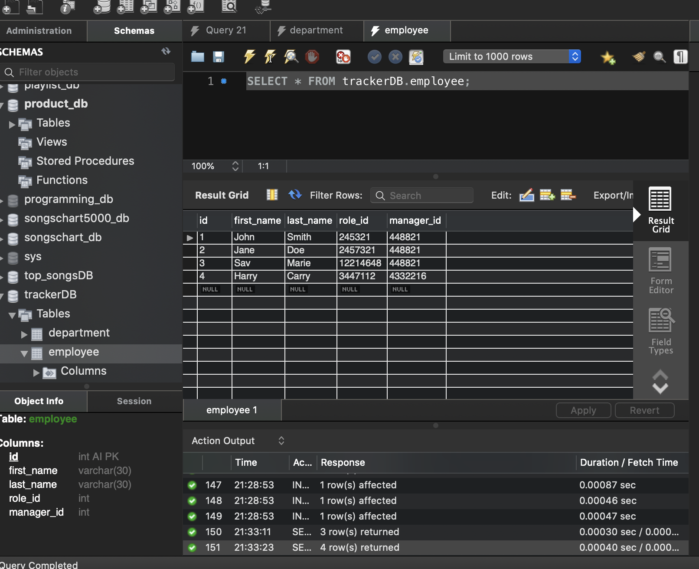
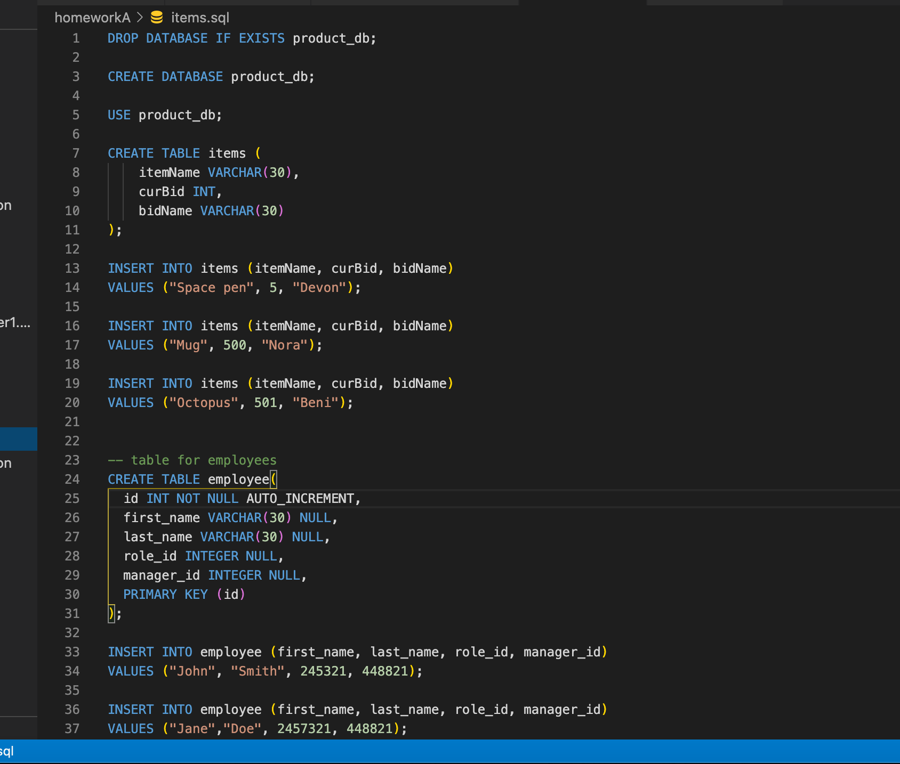

# Unit 12 MySQL Homework: Employee Tracker

---

## Description
For this homework assignment we were tasked with using mySQL Workbench and *testing functions* to generate a **Items in a Table** file. The items.sql page would set up the table and the different catagories that can be filled out within the table. The user can follow the prompts provided to then and fill in all the necessary information to create the employee tracker with __data & info__. Functions had to be generated so that they can be called on to not only write the table entries but to also provide the correct questions depending on what position the employee that was being added was. Making sure that all the new entries can be merged and interact so that they can work within __mySQL__. Styling of the page wasn't required since this was a backend assignment.

---

## Table of Contents
* [Description](#description)
* [Instructions](#instructions)
* [Installation](#installation)
* [ScreenShots](#screenshots)
* [License](#license)
* [Challenges](#challenges)
* [Gif](#gif)
* [Contact](#contact)

---

## Instructions

Design the following database schema containing three tables:

* **department**:

  * **id** - INT PRIMARY KEY
  * **name** - VARCHAR(30) to hold department name

* **role**:

  * **id** - INT PRIMARY KEY
  * **title** -  VARCHAR(30) to hold role title
  * **salary** -  DECIMAL to hold role salary
  * **department_id** -  INT to hold reference to department role belongs to

* **employee**:

  * **id** - INT PRIMARY KEY
  * **first_name** - VARCHAR(30) to hold employee first name
  * **last_name** - VARCHAR(30) to hold employee last name
  * **role_id** - INT to hold reference to role employee has
  * **manager_id** - INT to hold reference to another employee that manager of the current employee. This field may be null if the employee has no manager

## Installation

In order to get this __Employee Tracker__ to work, the first task was to download and install all of the necessary programming information. This meant loading all of the necessary __npm__ and __node.js__ add ons. This was extremely easy especially since we went over ane practiced thus several times during class this week. Each of the packages installed in very little time and with the addition of the __.gitignore__ file, everything was ready for this assignment. The final step was making sure the *mySQL Workbench* is up and running correctly.

---

## ScreenShots

Here are a few screenshots that I took throughout this homework assignment:

---

## License

MIT

Licensed under the [MIT License](LICENSE).

---

## challenges

This assignment came with quite a few challenges, and the first one that I encountered was going through the __working files__. Going back between the index.js file and the items.sql file  took some time to get used too, to just ensure that the database matches and that the config.json file has the right password and PORT. Once I was able to get the *mySQL Workbench* to recognize itself in the terminal. I found that I had the wrong password in my __config.json__ file which kept throwing errors that it couldn't find the correct mySQL table. Once I was able to solve this problem the next one that I ran into was the fact that I needed to use inquirer to get the correct array of questions to display. The next problem that I encountered was writing out a __question array__ that would answer all of the necessary fields for the assignment. This was a challenge at first because I wasn't sure that I could have the arrays all in one or if it had to go off of one array and then modify the one differing question based on the position. I was able to address this problem by making a different array for each table, this was the most *obvious* solution, and in the end was the best choice. The third and final challenge that I encountered was messing with getting all of the questions to *pop up* when you switch between options in the array. This only became a problem since some of my functions that I had called above weren't __pushing__ their information into the correct position in the table so that it could all be merged later.
---

## Gif

Here is the Team Builder in action:

---

## Contact

If you would like to contact me:

GitHub: [Arewinkl](https://github.com/arewinkl)

Email: alecrewinkel@gmail.com

